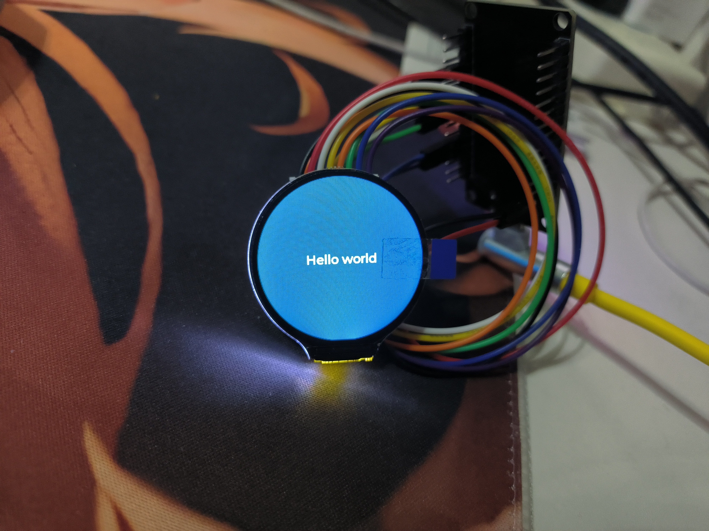
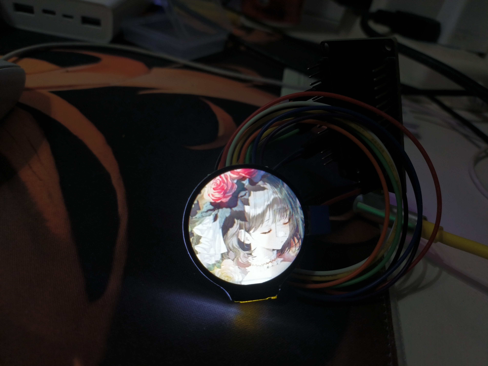
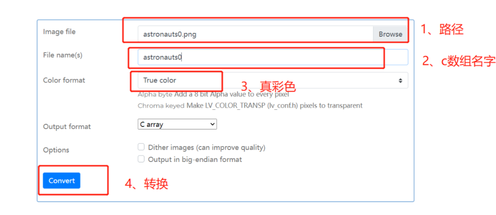
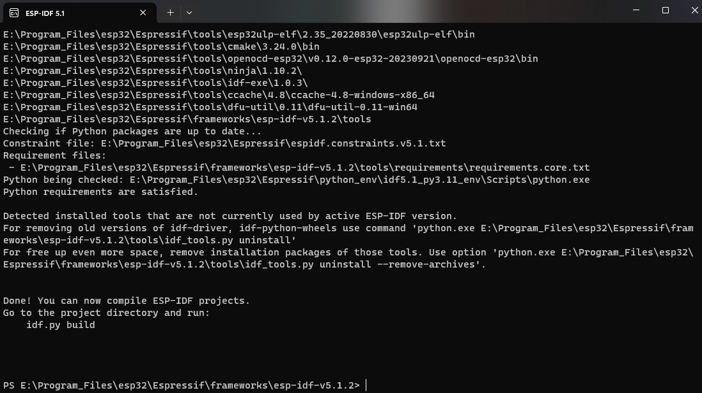
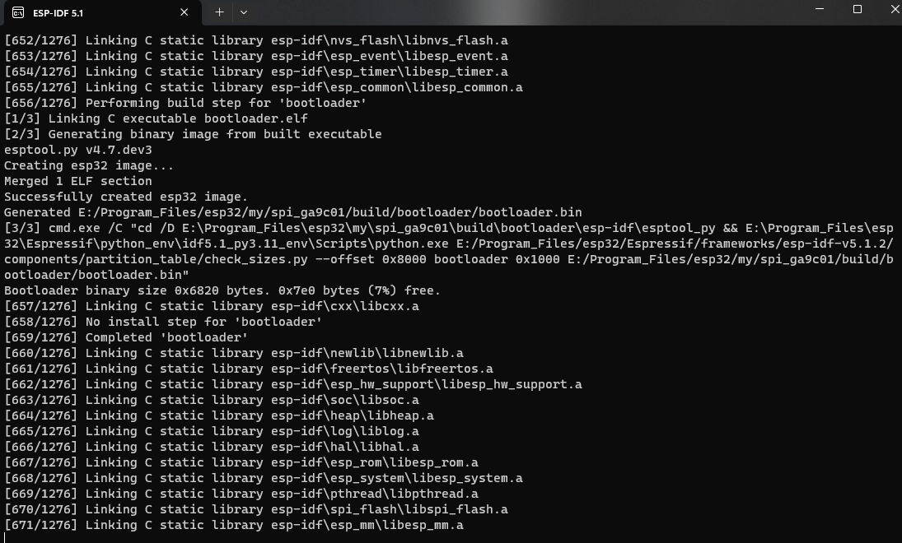
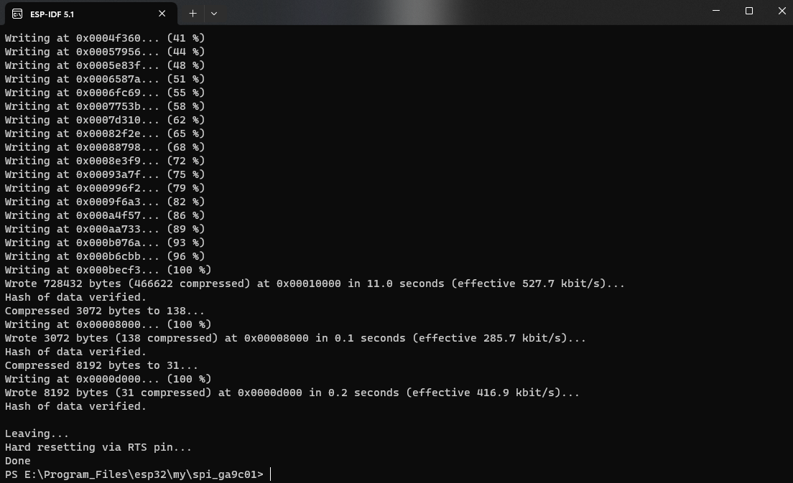

- [esp32驱动GA9C01](#esp32驱动ga9c01)
  - [硬件准备](#硬件准备)
  - [组件设置](#组件设置)
    - [如何添加组件](#如何添加组件)
  - [软件编写](#软件编写)
    - [第一部分：驱动GA9C01屏幕](#第一部分驱动ga9c01屏幕)
      - [驱动SPI总线](#驱动spi总线)
      - [初始化 LCD 面板的 IO 和 SPI 参数](#初始化-lcd-面板的-io-和-spi-参数)
      - [初始化 LCD 面板的设备参数](#初始化-lcd-面板的设备参数)
      - [安装GA9C01设备](#安装ga9c01设备)
    - [第二部分：屏幕显示](#第二部分屏幕显示)
      - [初始化配置LVGL](#初始化配置lvgl)
      - [注册显示设备到LVGL](#注册显示设备到lvgl)
      - [安装 LVGL 的时钟定时器](#安装-lvgl-的时钟定时器)
      - [创建LVGL任务](#创建lvgl任务)
      - [LVGL界面显示设计](#lvgl界面显示设计)
  - [附录](#附录)
    - [LVGL图片生成器的使用](#lvgl图片生成器的使用)
    - [如何使用项目](#如何使用项目)


# esp32驱动GA9C01

## 硬件准备
- esp32开发板
- GA9C01TFT屏幕（不带触摸芯片）
- 接线视图
    ```
    BLK -> GPIO2 (D2)
    CS  -> GPIO4 (D4)
    DC  -> GPIO5 (D5)
    RES -> GPIO3 (RX0)
    SDA -> GPIO19 (D19)
    SCL -> GPIO18 (D18)
    VIN -> 3V3
    GND -> GND
    ``` 
    好的，你已经完成了接线，下面只需要完成软件部分的驱动就行了！

## 组件设置

我们这个示例使用了一下esp官方组件
  - `lvgl/lvgl: "8.3.0"`
  - `esp_lcd_gc9a01: "1.0"`
  - `esp_lcd_touch_stmpe610: "1.0"` :（没有硬件未进行测试）

### 如何添加组件
在`main`文件夹下添加`idf_component.yml`文件，并填入以下内容，他会在项目编译时从esp官方组件库中下载
```
dependencies:
    idf: ">=4.4" 
    lvgl/lvgl: "~8.3.0"
    esp_lcd_gc9a01: "^1.0"
    esp_lcd_touch_stmpe610: "^1.0"
```

## 软件编写

本次使用的是`ESP-IDF 5.1`，而非`Arduion-IDE`，因此你需要先确定你电脑上是否有可运行的`ESP-IDF 5.1`，这部分不做过多说明

本程序根据esp官方案例改写而成
### 第一部分：驱动GA9C01屏幕

#### 驱动SPI总线

- 先创建一个SPI的结构体
    ```c
    /*
    #define EXAMPLE_PIN_NUM_SCLK           18
    #define EXAMPLE_PIN_NUM_MOSI           19
    #define EXAMPLE_PIN_NUM_MISO           21
    #define EXAMPLE_PIN_NUM_LCD_DC         5
    #define EXAMPLE_PIN_NUM_LCD_RST        3
    #define EXAMPLE_PIN_NUM_LCD_CS         4
    #define EXAMPLE_PIN_NUM_BK_LIGHT       2
    */
    spi_bus_config_t buscfg = {
        .sclk_io_num = EXAMPLE_PIN_NUM_SCLK,
        .mosi_io_num = EXAMPLE_PIN_NUM_MOSI,
        .miso_io_num = EXAMPLE_PIN_NUM_MISO,
        .quadwp_io_num = -1,
        .quadhd_io_num = -1,
        .max_transfer_sz = EXAMPLE_LCD_H_RES * 80 * sizeof(uint16_t),
    };
    ``` 
- 使用`spi_bus_initialize`函数进行使能，通过`ESP_ERROR_CHECK`进行错误检查，其中LCD_HOST是SPI2_HOST，即初始化的是esp的SPI2总线，第二个参数传入上面配置的SPI结构体
    ```c
    ESP_ERROR_CHECK(spi_bus_initialize(LCD_HOST, &buscfg, SPI_DMA_CH_AUTO));
    ``` 
#### 初始化 LCD 面板的 IO 和 SPI 参数

- 定义两个变量
    ```c
    esp_lcd_panel_io_handle_t io_handle = NULL;
    esp_lcd_panel_io_spi_config_t io_config ;
    ``` 
- `io_config`中含有一下内容
    ```c
    esp_lcd_panel_io_spi_config_t io_config = {
        .dc_gpio_num = EXAMPLE_PIN_NUM_LCD_DC,
        .cs_gpio_num = EXAMPLE_PIN_NUM_LCD_CS,
        .pclk_hz = EXAMPLE_LCD_PIXEL_CLOCK_HZ,
        .lcd_cmd_bits = EXAMPLE_LCD_CMD_BITS,
        .lcd_param_bits = EXAMPLE_LCD_PARAM_BITS,
        .spi_mode = 0,
        .trans_queue_depth = 10,
        .on_color_trans_done = example_notify_lvgl_flush_ready,
        .user_ctx = &disp_drv,
    };
    ``` 
    这里做说明：  
    > `dc_gpio_num`：LCD 面板的数据/命令切换引脚（Data/Command Pin）所连接的 GPIO 引脚号。  
    > `cs_gpio_num`：LCD 面板的片选引脚（Chip Select Pin）所连接的 GPIO 引脚号。  
    > `pclk_hz：LCD` 面板的像素时钟频率。  
    > `lcd_cmd_bits`：LCD 面板的命令位数。  
    > `lcd_param_bits`：LCD 面板的参数位数。  
    > `spi_mode`：SPI 模式，这里设置为 0。  
    > `trans_queue_depth`：传输队列深度，用于管理 SPI 传输的缓冲区大小。  
    > `on_color_trans_done`：当颜色数据传输完成时的回调函数，这里是   example_notify_lvgl_flush_ready。  
    > `user_ctx`：用户上下文，这里是指向 disp_drv 的指针。  

- 将LCD面板配置到SPI总线上，使用`esp_lcd_new_panel_io_spi`将IO句柄添加到SPI总线上
    ```c
    ESP_ERROR_CHECK(esp_lcd_new_panel_io_spi((esp_lcd_spi_bus_handle_t)LCD_HOST, &io_config, &io_handle));
    ``` 
#### 初始化 LCD 面板的设备参数
- LCD 面板的设备参数，包括复位引脚、RGB 元素顺序和像素位数。后续可以使用 panel_handle 句柄来操作 LCD 面板
    ```c
    esp_lcd_panel_handle_t panel_handle = NULL;
    esp_lcd_panel_dev_config_t panel_config = {
        .reset_gpio_num = EXAMPLE_PIN_NUM_LCD_RST,
        .rgb_ele_order = LCD_RGB_ELEMENT_ORDER_BGR,
        .bits_per_pixel = 16,
    };
    ``` 
    参数说明：
    > `reset_gpio_num`：LCD 面板的复位引脚（Reset Pin）所连接的 GPIO 引脚号。  
    > `rgb_ele_order`：LCD 面板的 RGB 元素顺序，这里设置为 BGR。  
    > `bits_per_pixel`：每个像素的位数，这里设置为 16 位。

#### 安装GA9C01设备

- 将结构体配置的信息传入一些配置函数
    ```c
    ESP_LOGI(TAG, "Install GC9A01 panel driver");
    ESP_ERROR_CHECK(esp_lcd_new_panel_gc9a01(io_handle, &panel_config, &panel_handle));
    ESP_ERROR_CHECK(esp_lcd_panel_reset(panel_handle));
    ESP_ERROR_CHECK(esp_lcd_panel_init(panel_handle));
    ESP_ERROR_CHECK(esp_lcd_panel_invert_color(panel_handle, true));
    ESP_ERROR_CHECK(esp_lcd_panel_mirror(panel_handle, true, false));
    ESP_ERROR_CHECK(esp_lcd_panel_disp_on_off(panel_handle, true));
    ``` 
    到这里你已经在esp32上安装了GA9C01的驱动，可以驱动GA9C01啦，但是现在你还不能在屏幕上显示图片，需要编写图形显示函数。这里我是使用LVGL来实现

### 第二部分：屏幕显示

#### 初始化配置LVGL
- 初始化LVGL
    ```c
    ESP_LOGI(TAG, "Initialize LVGL library");
    lv_init();
    ``` 
- 创建两个绘画缓冲区，为了加速图形显示的速率
    ```c
    lv_color_t *buf1 = heap_caps_malloc(EXAMPLE_LCD_H_RES * 20 * sizeof(lv_color_t), MALLOC_CAP_DMA);
    assert(buf1);
    lv_color_t *buf2 = heap_caps_malloc(EXAMPLE_LCD_H_RES * 20 * sizeof(lv_color_t), MALLOC_CAP_DMA);
    assert(buf2);
    // initialize LVGL draw buffers
    lv_disp_draw_buf_init(&disp_buf, buf1, buf2, EXAMPLE_LCD_H_RES * 20);
    ``` 
    代码说明：
    > 这里使用 `heap_caps_malloc` 函数分别为 `buf1` 和 `buf2` 分配了内存空间。每个内存块的大小为 `EXAMPLE_LCD_H_RES * 20 * sizeof(lv_color_t)` 字节，`EXAMPLE_LCD_H_RE`S 表示 LCD 面板的水平分辨率。`MALLOC_CAP_DMA` 参数表示在可用的情况下使用 DMA（直接内存访问）进行内存分配，以提高性能。使用 `assert` 函数对分配的内存进行断言，确保内存分配成功。  
    > 将内存块分别分配给 `lv_disp_draw_buf_t` 结构体的成员:`lv_disp_draw_buf_init(&disp_buf, buf1, buf2, EXAMPLE_LCD_H_RES * 20);`  
    > `lv_disp_draw_buf_init` 函数用于初始化 `lv_disp_draw_buf_t` 结构体。它接受四个参数  
    > `&disp_buf`：指向 lv_disp_draw_buf_t 结构体的指针，用于存储绘图缓冲区的信息。  
    > `buf1`：第一个绘图缓冲区的起始地址。  
    > `buf2`：第二个绘图缓冲区的起始地址。  
    > `EXAMPLE_LCD_H_RES * 20`：绘图缓冲区的大小，这里是 LCD 面板的水平分辨率乘以 20，表示每行有 20 个像素的绘图缓冲区。  

#### 注册显示设备到LVGL
- 代码部分
    ```c
    /*
    #define EXAMPLE_LCD_H_RES              240
    #define EXAMPLE_LCD_V_RES              240
    */
    ESP_LOGI(TAG, "Register display driver to LVGL");
    lv_disp_drv_init(&disp_drv);
    disp_drv.hor_res = EXAMPLE_LCD_H_RES;
    disp_drv.ver_res = EXAMPLE_LCD_V_RES;
    disp_drv.flush_cb = example_lvgl_flush_cb;
    disp_drv.drv_update_cb = example_lvgl_port_update_callback;
    disp_drv.draw_buf = &disp_buf;
    disp_drv.user_data = panel_handle;
    lv_disp_t *disp = lv_disp_drv_register(&disp_drv);
    ```
    代码说明： 
    > `lv_disp_drv_init(&disp_drv);` 初始化一个 lv_disp_drv_t 结构体变量 disp_drv，该结构体用于配置和管理显示驱动。
    > `hor_res`：表示显示驱动的水平分辨率  
    > `ver_res`：表示显示驱动的垂直分辨率  
    > `flush_cb`：表示刷新回调函数，在 LVGL 需要刷新显示时调用的函数。  
    > `drv_update_cb`：表示驱动更新回调函数，即在 LVGL 需要更新驱动时调用的函数。
    > `draw_buf`：表示绘图缓冲区。这里使用之前初始化的 lv_disp_draw_buf_t 结构体变量 disp_buf。
    > `user_data`：表示用户数据。这里将 LCD 面板的句柄 panel_handle 分配给 user_data。
    > `lv_disp_t *disp = lv_disp_drv_register(&disp_drv);`：将 disp_drv 结构体注册到 LVGL，并返回一个 lv_disp_t 类型的指针 disp，表示注册后的显示设备。

    - 刷新回调函数
        ```c
        static void example_lvgl_flush_cb(lv_disp_drv_t *drv, const lv_area_t *area, lv_color_t *color_map)
        {
            esp_lcd_panel_handle_t panel_handle = (esp_lcd_panel_handle_t) drv->user_data;
            int offsetx1 = area->x1;
            int offsetx2 = area->x2;
            int offsety1 = area->y1;
            int offsety2 = area->y2;
            // copy a buffer's content to a specific area of the display
            esp_lcd_panel_draw_bitmap(panel_handle, offsetx1, offsety1, offsetx2 + 1, offsety2 + 1, color_map);
        }
        ``` 
    - 刷新回调函数（有触摸的条件宏定义）
        ```c
        static void example_lvgl_port_update_callback(lv_disp_drv_t *drv)
        {
            esp_lcd_panel_handle_t panel_handle = (esp_lcd_panel_handle_t) drv->user_data;

            switch (drv->rotated) {
            case LV_DISP_ROT_NONE:
                // Rotate LCD display
                esp_lcd_panel_swap_xy(panel_handle, false);
                esp_lcd_panel_mirror(panel_handle, true, false);
        #if CONFIG_EXAMPLE_LCD_TOUCH_ENABLED
                // Rotate LCD touch
                esp_lcd_touch_set_mirror_y(tp, false);
                esp_lcd_touch_set_mirror_x(tp, false);
        #endif
                break;
            case LV_DISP_ROT_90:
                // Rotate LCD display
                esp_lcd_panel_swap_xy(panel_handle, true);
                esp_lcd_panel_mirror(panel_handle, true, true);
        #if CONFIG_EXAMPLE_LCD_TOUCH_ENABLED
                // Rotate LCD touch
                esp_lcd_touch_set_mirror_y(tp, false);
                esp_lcd_touch_set_mirror_x(tp, false);
        #endif
                break;
            case LV_DISP_ROT_180:
                // Rotate LCD display
                esp_lcd_panel_swap_xy(panel_handle, false);
                esp_lcd_panel_mirror(panel_handle, false, true);
        #if CONFIG_EXAMPLE_LCD_TOUCH_ENABLED
                // Rotate LCD touch
                esp_lcd_touch_set_mirror_y(tp, false);
                esp_lcd_touch_set_mirror_x(tp, false);
        #endif
                break;
            case LV_DISP_ROT_270:
                // Rotate LCD display
                esp_lcd_panel_swap_xy(panel_handle, true);
                esp_lcd_panel_mirror(panel_handle, false, false);
        #if CONFIG_EXAMPLE_LCD_TOUCH_ENABLED
                // Rotate LCD touch
                esp_lcd_touch_set_mirror_y(tp, false);
                esp_lcd_touch_set_mirror_x(tp, false);
        #endif
                break;
            }
        }
        ``` 
#### 安装 LVGL 的时钟定时器

- 代码部分
    ```c
    ESP_LOGI(TAG, "Install LVGL tick timer");
    // Tick interface for LVGL (using esp_timer to generate 2ms periodic event)
    const esp_timer_create_args_t lvgl_tick_timer_args = {
        .callback = &example_increase_lvgl_tick,
        .name = "lvgl_tick"
    };
    esp_timer_handle_t lvgl_tick_timer = NULL;
    ESP_ERROR_CHECK(esp_timer_create(&lvgl_tick_timer_args, &lvgl_tick_timer));
    ESP_ERROR_CHECK(esp_timer_start_periodic(lvgl_tick_timer, EXAMPLE_LVGL_TICK_PERIOD_MS * 1000));
    ``` 
    代码说明：
    > 安装 LVGL 的时钟定时器，以提供给 LVGL 的时间基准，用于处理动画、定时器和其他时间相关的操作。
    - 首先定义了一个 esp_timer_create_args_t 类型的结构体变量 lvgl_tick_timer_args，用于存储定时器的配置参数。在该结构体中，指定了回调函数和定时器的名称。
    - `esp_timer_handle_t lvgl_tick_timer = NULL;` 
      - 定义了一个 esp_timer 句柄 lvgl_tick_timer。
    - `ESP_ERROR_CHECK(esp_timer_create(&lvgl_tick_timer_args, &lvgl_tick_timer));` 
      - 使用 esp_timer_create 函数创建一个周期性的定时器。将之前定义的 lvgl_tick_timer_args 作为配置参数传递给该函数，将创建的定时器句柄存储在 lvgl_tick_timer 中。
    - `ESP_ERROR_CHECK(esp_timer_start_periodic(lvgl_tick_timer, EXAMPLE_LVGL_TICK_PERIOD_MS * 1000));`
      - 使用 esp_timer_start_periodic 函数启动定时器。将之前创建的定时器句柄 lvgl_tick_timer 以及时间间隔作为参数传递给该函数。时间间隔由宏定义 EXAMPLE_LVGL_TICK_PERIOD_MS 表示，单位为毫秒，乘以 1000 将其转换为微秒。

#### 创建LVGL任务
- 代码部分
    ```c
    lvgl_mux = xSemaphoreCreateRecursiveMutex();
    assert(lvgl_mux);
    ESP_LOGI(TAG, "Create LVGL task");
    xTaskCreate(example_lvgl_port_task, "LVGL", EXAMPLE_LVGL_TASK_STACK_SIZE, NULL, EXAMPLE_LVGL_TASK_PRIORITY, NULL);
    ``` 
    代码说明：
    > 创建一个 LVGL 任务，并为 LVGL 提供一个互斥锁
    - `lvgl_mux = xSemaphoreCreateRecursiveMutex();` 
      - 创建了一个递归互斥锁 lvgl_mux。递归互斥锁允许同一个任务多次获取锁，避免死锁情况的发生。xSemaphoreCreateRecursiveMutex 函数用于创建一个递归互斥锁，并将其句柄分配给 lvgl_mux。
    - `assert(lvgl_mux);` 
      - 进行断言检查，确保互斥锁创建成功。如果互斥锁创建失败，则断言失败，程序终止。
    - `ESP_LOGI(TAG, "Create LVGL task");` 
      - 记录了一个日志信息，指示正在创建 LVGL 任务。
    - `xTaskCreate(example_lvgl_port_task, "LVGL", EXAMPLE_LVGL_TASK_STACK_SIZE, NULL, EXAMPLE_LVGL_TASK_PRIORITY, NULL);` 
      - 使用 xTaskCreate 函数创建一个任务。该任务的入口函数为 example_lvgl_port_task，任务名称为 "LVGL"。EXAMPLE_LVGL_TASK_STACK_SIZE 表示任务堆栈大小，EXAMPLE_LVGL_TASK_PRIORITY 表示任务优先级。最后一个参数为任务句柄，这里传入 NULL 表示不需要获取任务句柄。

#### LVGL界面显示设计
- 代码部分
    ```c
    if (example_lvgl_lock(-1)) {

        //显示图片
        // LV_IMG_DECLARE(a);
        // lv_obj_t * img = lv_img_create(lv_scr_act());
        // lv_img_set_src(img, &a);
        // lv_obj_set_pos(img, -50, -50);

        // example_lvgl_demo_ui(disp);
        /*Change the active screen's background color*/

        //helloworld
        // lv_obj_set_style_bg_color(lv_scr_act(), lv_color_hex(0x003a57), LV_PART_MAIN);
        // /*Create a white label, set its text and align it to the center*/
        // lv_obj_t * label = lv_label_create(lv_scr_act());
        // lv_label_set_text(label, "Hello world");
        // lv_obj_set_style_text_color(lv_scr_act(), lv_color_hex(0xffffff), LV_PART_MAIN);
        // lv_obj_align(label, LV_ALIGN_CENTER, 0, 0);
        // Release the mutex
        example_lvgl_unlock();
    }
    ``` 
    我这里提供两个示例
    - `hello world`
        ```c
        //使用的是LVGL 8.3.0 版本
        if (example_lvgl_lock(-1)) {
            lv_obj_set_style_bg_color(lv_scr_act(), lv_color_hex(0x003a57), LV_PART_MAIN);
            lv_obj_t * label = lv_label_create(lv_scr_act());
            lv_label_set_text(label, "Hello world");
            lv_obj_set_style_text_color(lv_scr_act(), lv_color_hex(0xffffff), LV_PART_MAIN);
            lv_obj_align(label, LV_ALIGN_CENTER, 0, 0);
            example_lvgl_unlock();
        }
        ``` 
        
    - 图片显示（数组缓存）
        ```c
        if (example_lvgl_lock(-1)) {
            //显示图片
            LV_IMG_DECLARE(a);
            lv_obj_t * img = lv_img_create(lv_scr_act());
            lv_img_set_src(img, &a);
            lv_obj_set_pos(img, -50, -50);
            example_lvgl_unlock();
        }   
        ``` 
        代码说明：
        - `LV_IMG_DECLARE(a);` ：声明图像
        - `lv_obj_t * img = lv_img_create(lv_scr_act());` ：创建 img
        - `lv_img_set_src(img, &a);` ：设置图片源
        - `lv_obj_set_pos(img, -50, -50);` ：图像偏移  
        > a 是我用lvgl官方的图片生成器（附录中包含使用步骤），将我要显示的图片转化为lvgl图片显示函数可以识别的数组文件，这个文件我们在显示的时候需要将他编译一下
        - 如何添加文件编译？
          - 修改`CmakeLists.txt`文件 （路径: `spi_ga9c01\main\CMakeLists.txt`）
            - 原本内容
            ```txt
            idf_component_register(SRCS "main.c" "lvgl_demo_ui.c"
                       INCLUDE_DIRS ".")
            ``` 
            - 修改后内容
            ```txt
            idf_component_register(SRCS "main.c" "lvgl_demo_ui.c" "a.c"
                       INCLUDE_DIRS ".")
            ``` 
        

## 附录

### LVGL图片生成器的使用

官方网址：https://lvgl.io/tools/imageconverter

对于源码内部图片（将图片转换为图片数组）想要将 PNG，JPG 或 BMP 格式的图像生成像素颜色数据数组，这需要使用专门的图片转换工具，刚好 lvgl 官方也为我们提供了这样的工具，该工具为网页版本，所以需要联网在线使用。具体样式和使用方法如下图所示。



然后将下载的数组文件移动到项目文件夹（路径：`spi_ga9c01\main\`）

### 如何使用项目

- 进入ESP-IDF 命令行界面，等待加载。出现如下界面证明已经加载好了
    
- 利用cd命令，进入到项目文件夹
  ```
  cd E:\Program_Files\esp32\my\spi_ga9c01
  ```
- 设置开发板型号
  ```
  idf.py set-target esp32
  ``` 
- 设置开发板和组件选项 （如果你只是体验示例，则不需要设置）
  ```
  idf.py menuconfig
  ``` 
- 编译加烧录 （能够自动识别到端口）
  ```
  idf.py flash
  ``` 
  

- 编译加烧录成功
   
  
